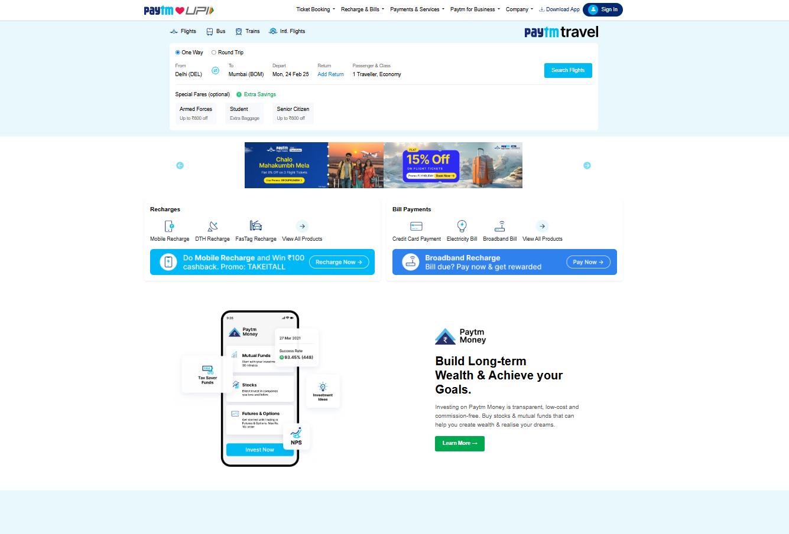

# Paytm Clone UI 🚀



A responsive, static web interface inspired by Paytm's design. Built using HTML, CSS and Bootstrap, this project demonstrates modern, mobile-friendly UI techniques with clean, modular code.

---

## 🔍 Overview

This project is a static clone of the Paytm website interface. It includes:
- A responsive navbar with dropdowns.
- A flight search section with journey type options and travel details.
- A carousel banner to showcase promotional offers.
- A special fares section displaying exclusive deals.

The design is fully responsive, ensuring a great user experience on desktop, tablet, and mobile devices.

---

## 🌟 Features

- **Responsive Layout:**  
  📱 Seamless design across all devices using Bootstrap and custom media queries.
- **Dynamic Navbar:**  
  🔄 Collapsible menu for mobile devices and interactive dropdowns.
- **Interactive Flight Search:**  
  ✈️ Includes journey type selection, travel details, and date pickers.
- **Carousel Banner:**  
  🎞️ Image slider with custom navigation for showcasing offers.
- **Special Fares Section:**  
  💰 Displays fare options with detailed savings information.

---

## 🛠️ Tech Stack

- **Frontend:** HTML, CSS, Bootstrap  
- **Icons:** Bootstrap Icons, Font Awesome

---

## 🚀 Installation

1. **Clone the Repository:**
   ```bash
   git clone https://github.com/yourusername/PaytmClone_UI.git
   cd PaytmClone_UI

2. **Open the Application**
   - Simply open index.html in your web browser to view the project.

## 🎯 Usage
- Navigation: Explore the dynamic navbar and dropdown menus.

- Flight Search: Use the search section to see how travel details and journey types are presented.

- Carousel & Special Fares:  View the sliding banners and fare options for a realistic look at promotional designs.

## 🤝 Contributing
- Contributions, issues, and feature requests are welcome! Please fork the repository and submit a pull request for any improvements.

